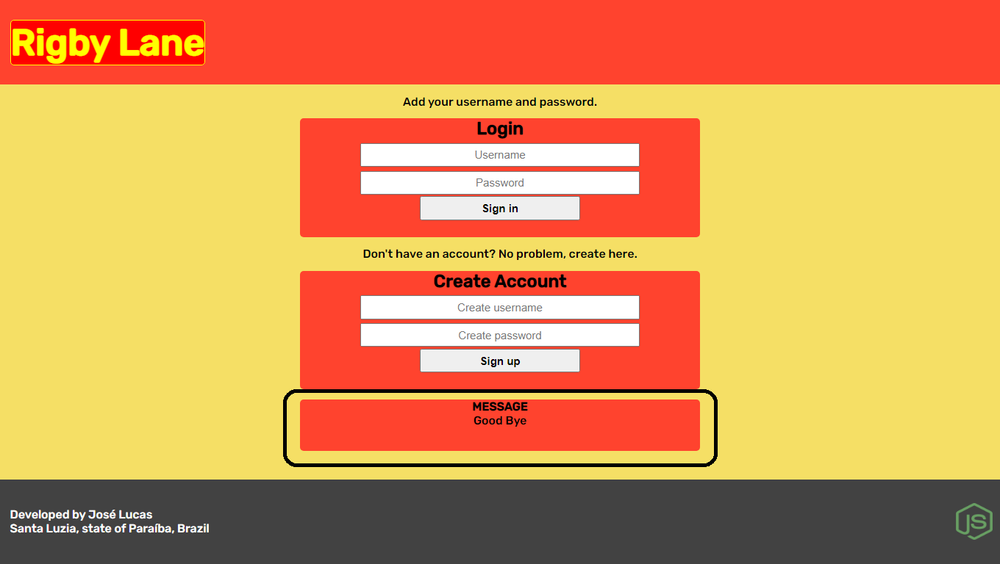
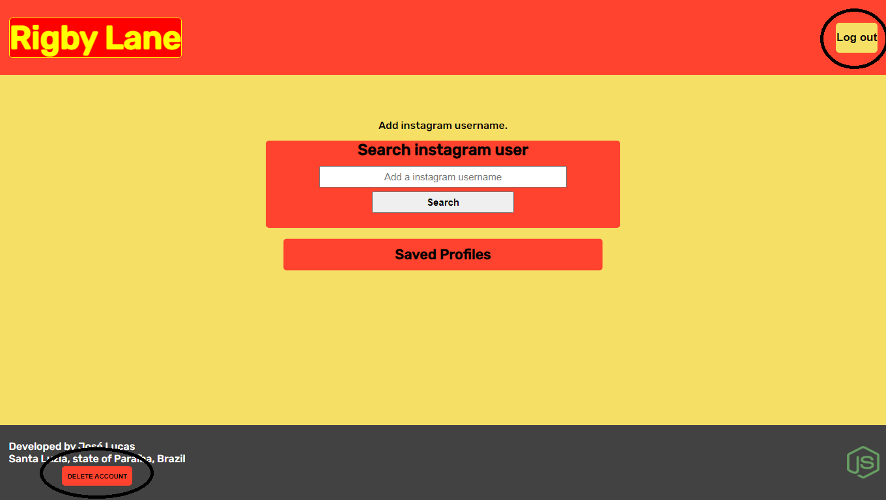
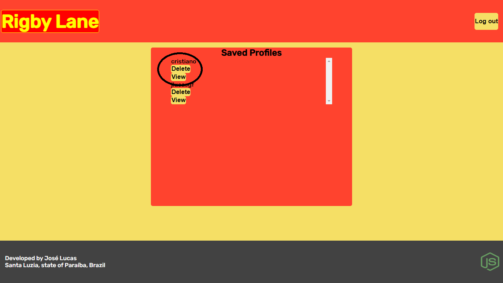

# Reporte-desafio-tecnico

## Ferramentas usadas

<p align='center'>
<table>
  <tr>
    <td>Express</td>
    <td>Express-Session</td>
    <td>Express-Validator</td>
    <td>Axios</td>
    <td>Body-Parser</td>
    <td>Consign</td>
    <td>EJS</td>
    <td>Mongoose</td>
    <td>MongoDB</td>
    <td>Arquitetura MVC</td>
  </tr>
</table>
</p>

## Como usar

  ```shell
  1- inicialize o servidor mongoDB
  2- cd "seu diretório desejado"
  3- git clone https://github.com/JoseLucasapp/Reporte-desafio-tecnico
  4- cd Reporte-desafio-tecnico
  5- npm start
  ```
## Sobre o projeto

<p align='center'>
  <ul>
    <li>Página de login e cadastro</li>
    <li>Página para informar o nome de usuário</li>
    <li>Página com os dados do perfil</li>
    <li>Página com os perfis salvos</li>
    <li>Opção de logout</li>
    <li>Opção de apagar a conta</li>
  </ul>
</p>

## Imagens

<p>Página inicial, o campo circulado é onde aparecem mensagens personalizadas, por exemplo "Good Bye" quando o usuário faz log out.</p>


<p>Página principal, com o campo para digitar o username do perfil desejado e com os botões de LOG OUT e de DELETAR CONTA.</p>


<p>Página onde se visualiza os dados do perfil desejado, está em destaque a logo(que faz referência a duas músicas dos Beatles) quando clicada retorna para a página principal.</p>


<p>Página onde ficam os perfis salvos, circulados o nome do usuário salvo, o botão VIEW que quando clicado busca pelo perfil e o botão DELETE que remove o perfil da lista de salvos.</p>

## Informações importantes

<p>A conexão com o instagram está irregular, em alguns momentos retorna resultados em outros não, nos dias 8,9 e 11 funcionou, porém nos dias 10 e 12 não funcionou</p>

## Author
<a href="https://www.instagram.com/jlucasgf/?hl=pt-br">José Lucas</a>
